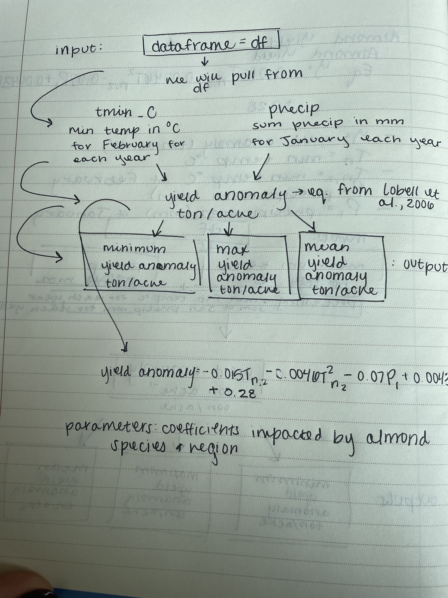

```{r setup, include=FALSE}
knitr::opts_chunk$set(echo = TRUE, message = FALSE, warning = FALSE)
```

# Conceptual Model



# Applying our function

## load packages and function

```{r, warning=FALSE, message=FALSE}
library(tidyverse)
source("R/almond_yield_anomaly.R")
```

## read in climate data

```{r}
clim <- read.table("data/clim.txt", header = TRUE)
```

## use function on climate data

```{r}
almond_yield_anomaly(clim)
```
